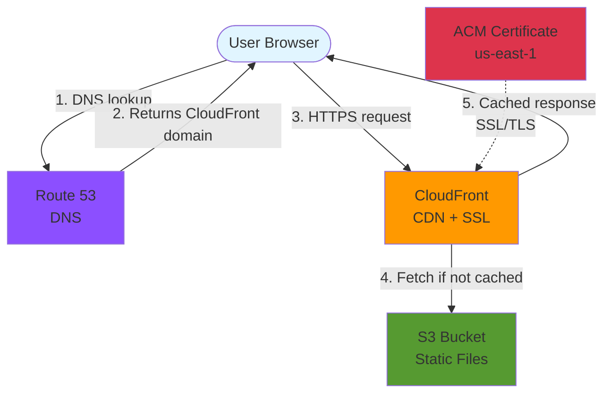

I recently rebuilt my personal site as a static blog hosted on AWS. Here's the architecture and why I made these choices.

## Why Static?

For a personal blog, static site generators hit the sweet spot:

- **Cost**: Pennies per month on S3/CloudFront
- **Performance**: CDN-cached HTML is as fast as it gets
- **Security**: No server to patch, no database to secure
- **Simplicity**: Markdown files in a Git repo

I chose [Hugo](https://gohugo.io/) for the generator—it's fast, has great themes, and the learning curve is gentle.

## The Architecture

Here's the production serving infrastructure:

### Components

**Route 53** handles DNS, pointing the domain to CloudFront via an ALIAS record.

**CloudFront** serves as the CDN, caching content at 450+ edge locations worldwide. It handles HTTPS termination and protects the origin.

**ACM** provides free SSL certificates. Must be provisioned in us-east-1 for CloudFront compatibility.

**S3** stores the static files. The bucket is private—CloudFront accesses it through Origin Access Control (OAC), not public URLs.

## Cost Breakdown

For a low-traffic personal blog, expect roughly:

| Service | Monthly Cost |
|---------|-------------|
| S3 | ~$0.03 |
| CloudFront | ~$0.10 |
| Route 53 | $0.50 |
| **Total** | **< $1.00** |

This assumes modest traffic. Even at 100K page views/month, you're likely under $5.

If you have questions or want to discuss the architecture, find me on [LinkedIn](https://www.linkedin.com/in/chadmullen).
